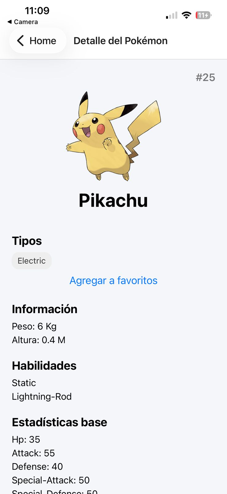
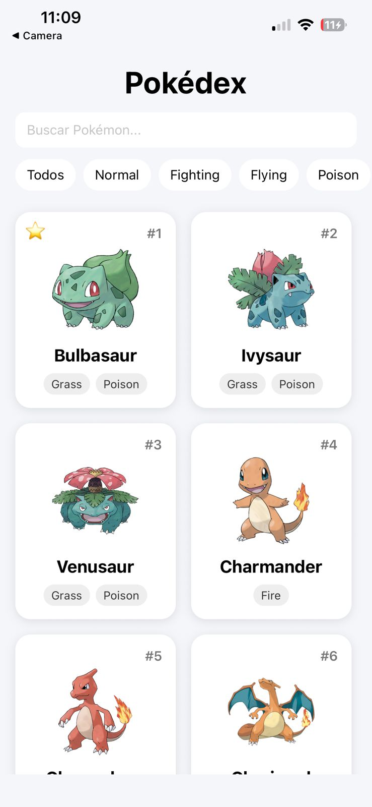
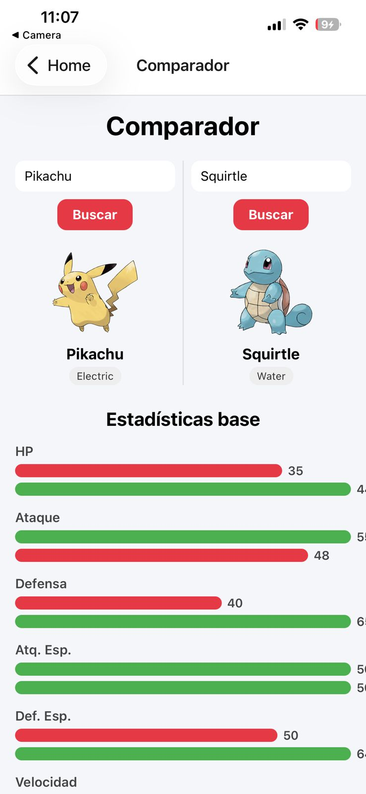

# Pokédex App

**Alumno:** Abraham Felipe Gonzalez Paez

## Descripción

Aplicación móvil tipo Pokédex desarrollada con Expo y React Native que consume la PokéAPI. Permite listar Pokémon, ver su detalle, buscar por nombre, filtrar por tipo, guardar favoritos y comparar estadísticas base entre dos Pokémon.

---

## Tecnologías utilizadas

- Expo + React Native
- TypeScript
- React Navigation (Native Stack)
- Axios
- AsyncStorage
- PokéAPI (https://pokeapi.co)

---

## Instalación

1. Clona el repositorio:
   ```bash
   git clone <url-del-repositorio>
   cd Pokedex-AppMoviles
   ```

2. Instala las dependencias:
   ```bash
   npm install
   ```

---

## Cómo ejecutar

```bash
npx expo start
```

Escanea el código QR con la app **Expo Go** en tu teléfono (iOS o Android).

---

## Funcionalidades implementadas

- Listado de Pokémon con imagen, número y tipos
- Detalle de Pokémon con peso, altura, habilidades y estadísticas base
- Búsqueda por nombre en tiempo real
- Filtro por tipo con scroll horizontal
- Favoritos con persistencia local usando AsyncStorage
- Indicador visual de favoritos en las tarjetas
- Comparador de estadísticas base entre dos Pokémon
- Estados de carga, error y sin resultados en todas las pantallas

---

## Estructura del proyecto

```
src/
├── components/
│   └── PokemonCard.tsx
├── screens/
│   ├── HomeScreen.tsx
│   ├── PokemonDetailScreen.tsx
│   └── CompareScreen.tsx
├── services/
│   └── pokeapi.ts
├── storage/
│   └── favorites.ts
└── types/
    ├── pokemon.ts
    └── navegation.ts
```

---

## Capturas de pantalla

|  |  | 

---

## Problemas encontrados y soluciones

- **Hooks fuera del componente** — `useState` estaba declarado fuera del componente, lo que causaba errores en tiempo de ejecución. Se movieron dentro del componente.
- **Favoritos no se actualizaban al volver al listado** — el `useEffect` solo se ejecutaba una vez al montar la pantalla. Se solucionó 

---

## API utilizada

- **PokéAPI:** https://pokeapi.co/api/v2
- Documentación: https://pokeapi.co/docs/v2
